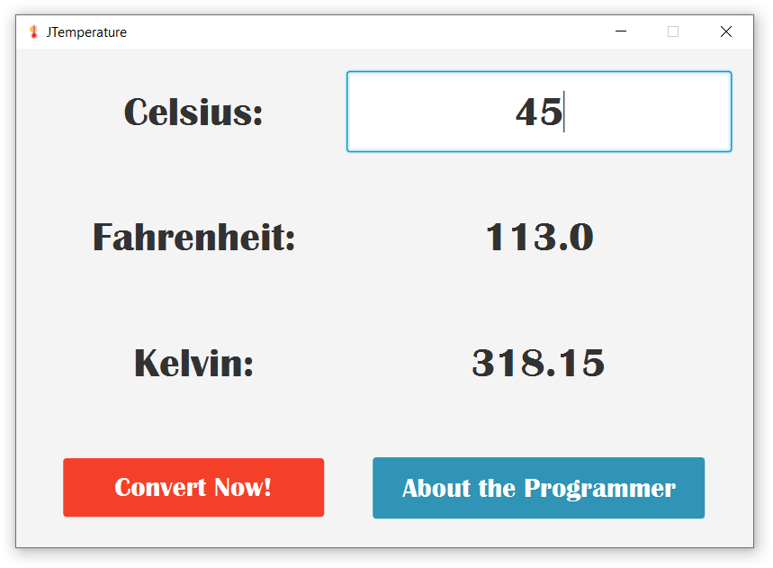

# JTemperature

  

A temperature conversion application. Rather simplistic on it's own right. But you can still take a look.

Created with Java and JavaFX using FXML.

Made in CS3231 Module at NUS High School.

  

